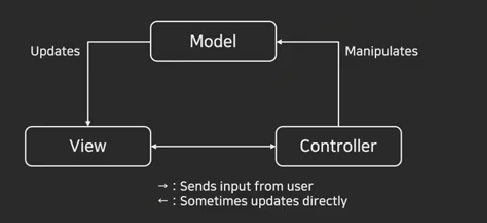

## MVC
 Model, View, Controller의 줄임말로 어플리케이션을 구성할 때 그 구성요소를 세가지의 역할로 구분한 채턴을 의미
 사용자 인터페이스로부터 비즈니스 로직을 분리하여 서로 영향 없이 쉽게 고칠 수 있는 설계가 가능
 

~~도식화는 참고한 할 것~~

**컨트롤러**  

모델과 뷰 사이에서 브릿지 역할을 수행    
컨트롤러로 들어온 요청은 어떻게 처리할 지 결정하여 모델로 요청을 전달함

**모델**

데이터를 처리하는 영역    
데이터베이스와 연동을 위한 DAO와 데이터의 구조를 표현하는 DO로 구성됨

**뷰**

데이터를 보여주는 화면 자체의 영역   
사용자 인터페이스 요소들이 여기에 포함되며, 데이터를 각 요소에 배치함   
뷰에서는 별도의 데이터를 보관하지 않음

### MVC 패턴의 특징
- 어플리케이션의 역할을 세 구간으로 나누어 설계함으로써 서로 간의 의존성이 낮아짐
- 각 영역이 독립적으로 구성되어 개발자 간 분업 및 협업이 원활해짐
- 한 영역을 업데이터 하더라도 다른 곳에 영향을 주지 않음
 