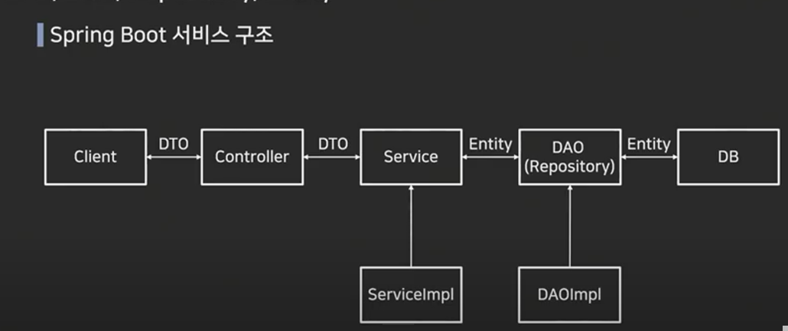

## DTO, DAO, Repositort, Entity

client는 frontEnd 모델        
controller에서 받은 DTO 정보를 가지고 service에서 db저장에 더 필요한 것들을 추가해서 entity로 만듭니다.

**Entity(Domain)**
데이터베이스에 쓰일 칼럼과 여러 엔티티간의 연관 관계를 정의
각 데이터베이스 테이블과 1:1 매칭

**Repository**
Entity에 의해 생성된 데이터베이스에 접근하는 메소드를 사용하기 위한 인터페이스
Service와 DB를 연결하는 고리의 역할을 수행
데이터베이스에 적용하고자하는 crud를 정의하는 영역

**DAO**
Data Access Object
데이터베이스에 접근하는 객체를 의미
Service가 DB에 연결할 수 있게 해주는 역할
DB를 사용하여 데이터를 조회하거나 조작하는 기능을 전담

**DTO**
Data Transfer Object
DTO는 VO로 불리기도 하며, 계층간 데이터 교환을 위한 객체를 의미합니다.
VO의 경우 Read Only의 개념을 가지고 있음
